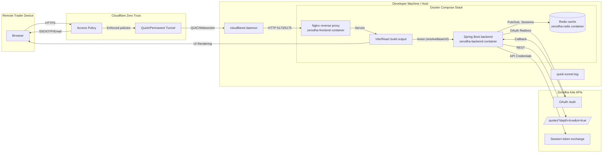
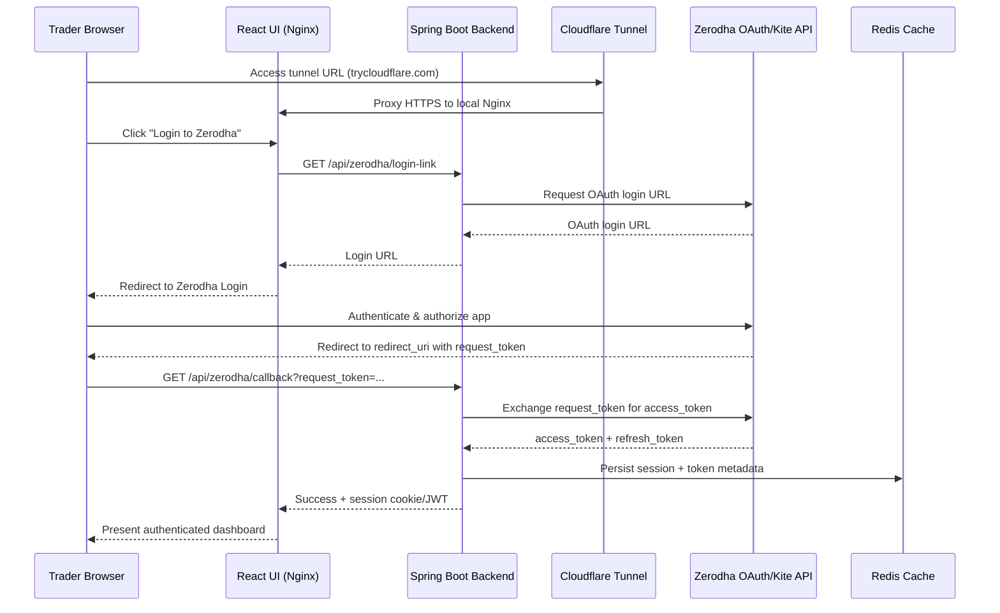
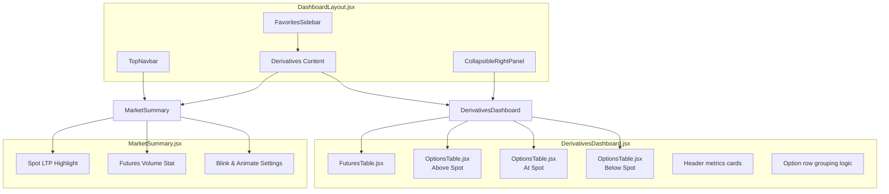

# Zerodha Trading Dashboard Architecture

This document captures the end-to-end architecture of the Zerodha Trading Dashboard, covering hosting topology, tunneling, authentication, market-data integration, UI layout, and deployment workflows. Each section includes Mermaid diagrams that can be rendered via [mermaid.live](https://mermaid.live) or any compatible viewer.

---

## 1. Deployment Topology



### Hosting & Networking Notes
- **Cloudflare Tunnel:** Provides secure public access without exposing local ports.
- **Cloudflare Access:** Optionally enforces email-domain or OTP-based access policies.
- **Docker Compose Stack:** Bundles frontend (Nginx + built React assets), backend (Spring Boot), and Redis cache.
- **Zerodha APIs:** Primary source for market data, option depth, futures quotes, and session tokens.

---

## 2. OAuth & Secure Session Lifecycle



### Authentication Observations
- **Dynamic Redirect URI:** Matches current tunnel hostname (temporary quick tunnel or permanent domain).
- **Session Storage:** Redis caches Zerodha tokens and session metadata, enabling quick revalidation.
- **Error Handling:** Frontend surfaces “unable to fetch login link” when base URL isn’t aligned with tunnel origin.

---

## 3. Market Data Refresh & UI Mapping Flow

```mermaid
sequenceDiagram
    participant Frontend as React DerivativesDashboard
    participant Backend as Spring Boot
    participant Redis as Redis
    participant Zerodha as Zerodha Quotes API

    loop Every 5s (configurable)
        Frontend->>Backend: GET /api/derivatives?underlying=NIFTY
        Backend->>Redis: Check cached derivatives snapshot
        alt Cache hit and fresh
            Redis-->>Backend: Return cached payload
        else Cache miss or stale
            Backend->>Zerodha: GET /quotes?i=NSE:NIFTY25NOVFUT&depth=true&oi=true
            Zerodha-->>Backend: Market data response
            Backend->>Redis: Store normalized snapshot
        end
        Backend-->>Frontend: Normalized derivatives DTO
        Frontend->>Frontend:
            - Use spotPrice as reference for ATM detection
            - Map futures & options to FuturesTable/OptionsTable
            - Update header stats & volume indicators
            - Re-render responsive tables & collapsible panels
    end
```

### Functional Highlights
- **ATM Selection:** Determined using `spotPrice` (not futures price) to align with trading practice.
- **Data Integrity:** Backend requests `depth=true&oi=true` to ensure non-zero bid/ask/OI values.
- **Timeout Handling:** Axios timeout configured for fast refresh without spurious `ECONNABORTED` errors.
- **UI Responsiveness:** Tables use fixed column widths, `overflow-x-auto`, and mobile-friendly layouts.

---

## 4. UI Component Architecture



### UI Considerations
- **Collapsible Panels:** Single toggle button for left (Favorites) panel; right panel toggle moved to navbar end.
- **Responsive Layout:** Left sidebar collapses into overlay on mobile; tables become scrollable cards in smaller viewports.
- **Theming:** Light mode uses white background; spot LTP presented in dark text for clarity.
- **Data Hooks:** `usePriceTracking` and other hooks drive updates at configurable intervals with error resilience.

---

## 5. DevOps & Runtime Workflow

```mermaid
flowchart TB
    DevRepo[(GitHub Repo<br/>feature/stable/release branches)]
    LocalCLI[PowerShell / Git CLI]
    DockerCompose{{docker-compose.yml}}
    Images[(Local Docker Images)]
    CloudflaredExe[cloudflared.exe (Quick Tunnel)]
    Scripts[scripts/*.ps1 automation]

    DevRepo -- git pull/push --> LocalCLI
    LocalCLI -- docker compose build/up --> DockerCompose
    DockerCompose -- builds --> Images
    DockerCompose -- runs --> Backend & Frontend & Redis
    LocalCLI -- start tunnel --> CloudflaredExe
    CloudflaredExe -- register & proxy --> Cloudflare Zero Trust
    Scripts -- optional automation --> DockerCompose
    Scripts -- optional automation --> CloudflaredExe
```

### Release & Branching
- **Feature Branch:** `feature/trading-refinements` holds ongoing enhancements and design refinements.
- **Stabilization Branch:** `stable1` snapshots deployable states; serves as base for `main` merges.
- **Release Branch:** `release/1.0.0` derived from `main` for tagging and release packaging.
- **Tagging:** `v1.0.0` marks specific release commits, aiding rollback and traceability.

---

## Functional Flow Summary

1. **User Access & Authentication**
   - Trader opens Cloudflare tunnel URL → Cloudflare Access policy (optional) → React frontend.
   - React requests Zerodha login link via backend API.
   - User authenticates with Zerodha; backend handles callback, obtains tokens, stores in Redis.

2. **Market Data Fetch & Presentation**
   - Frontend polls backend for derivatives data (interval optimized for trader needs).
   - Backend fetches quotes from Zerodha (with depth, OI), caches in Redis.
   - Frontend maps futures/options data to responsive tables, highlighting ATM strike.

3. **UI Interaction**
   - Left panel collapsible, right panel toggle in navbar, responsive layout for mobile.
   - Spot LTP emphasized; background colors adjusted for light/dark modes.
   - Error states handled gracefully with messaging for timeouts or data load issues.

4. **Deployment & Operations**
   - Docker Compose orchestrates frontend/backend/Redis locally.
   - Cloudflared quick tunnel publishes the stack securely for remote access.
   - Git flow: feature → stable → main → release branch → tag.

---

## Future Enhancements (Optional Ideas)
- Transition from quick tunnels to managed Cloudflare named tunnels with permanent hostnames.
- Integrate CI/CD pipeline for automated builds, tests, and deployment scripts.
- Add observability (Prometheus metrics, structured logging) for production readiness.
- Implement WebSocket-based push updates to reduce polling delay.
- Introduce feature flags for experimental UI/logic toggles.

---

_Document version: 1.0.0_  
_Last updated: {{CURRENT_DATE}}_


